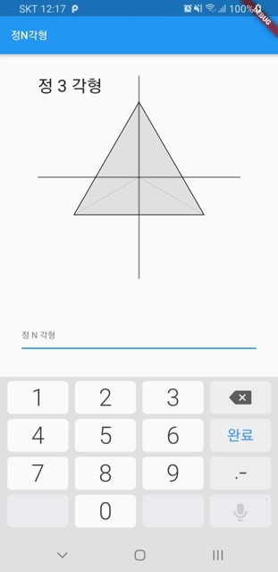
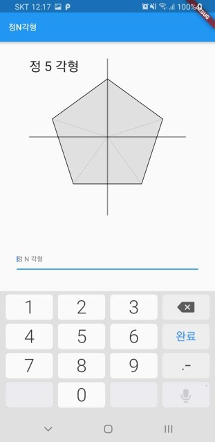
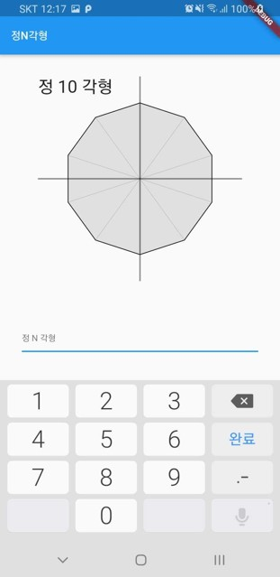

# Flutter 정다각형

숫자 (n)을 입력받아 정 n각형을 그리는 코드

## 사용 법

~~~dart
Widget  nShape({int side}) {
	return  CustomPaint(
		painter:  Shape(side: side), // N각형
		child:  Text(
			'정 $side 각형',
			style:  TextStyle(
				fontSize:  32,
			),
		),
	);
}
~~~

## 예시

 

